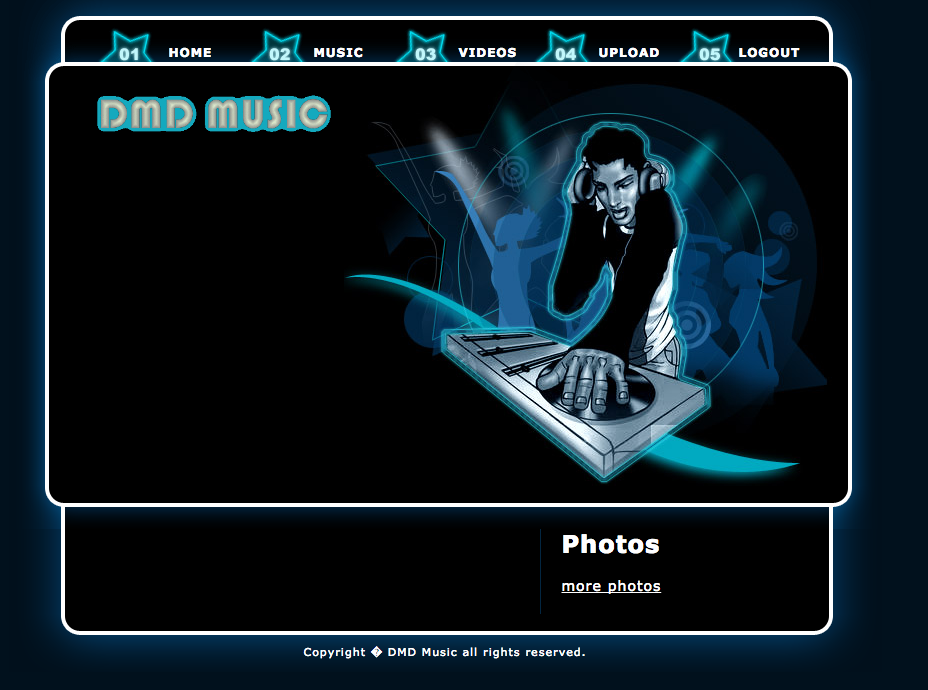
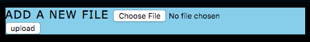
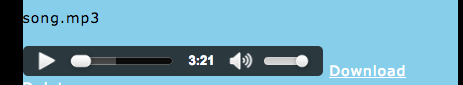

# all-about-music
[](https://travis-ci.org/denvereezy/all-about-music)

This app allows users to share they own music & videos with others and also explore what others have created.


#Getting started
##Installing dependencies
* If not already installed, install [node](https://www.digitalocean.com/community/tutorials/how-to-install-node-js-on-ubuntu-16-04).
* Clone this repo and change directory to it in the terminal: `~ $ cd all-about-music`.
* Now do `npm install`. This will install all modules used.

##Note
### One of the modules used needed to be changed a bit to be able to use it. 
* Locate the `node_modules` folder and go into the `multer` folder.
* Then go into the `storage` folder and you should see a `disk.js` file.
* Open the file and edit the `getFilename` function so that it looks like this:
 
``` javascript
function getFilename (req, file, cb) {
  crypto.pseudoRandomBytes(16, function (err, raw) {
    cb(err, err ? undefined : file.originalname)
  })
}
```
* This change will allow the user to download a file with its original name instead of random characters.
* To set up the database for the app use the script [setup.sql](./sql/setup.sql). For this [mysql-server](https://www.digitalocean.com/community/tutorials/how-to-install-mysql-on-ubuntu-14-04) should be installed.
 
##Running tests
* In the terminal run `mocha`. It can be installed using: `npm install mocha -g`.

##Starting the app
* Run `nodemon/node app.js` and you should see a message: `App running on http://:::2016`.
* In the brower type in `localhost:2016`.
* After signing up & logging in you should see a screen like this:


##Using the app
* You can uploaud music/videos and also delete those you don't want anymore.
 
* If you don't want to upload you can watch/listen to content of other people.
*  
* If you like it you can download it if they allow it.


